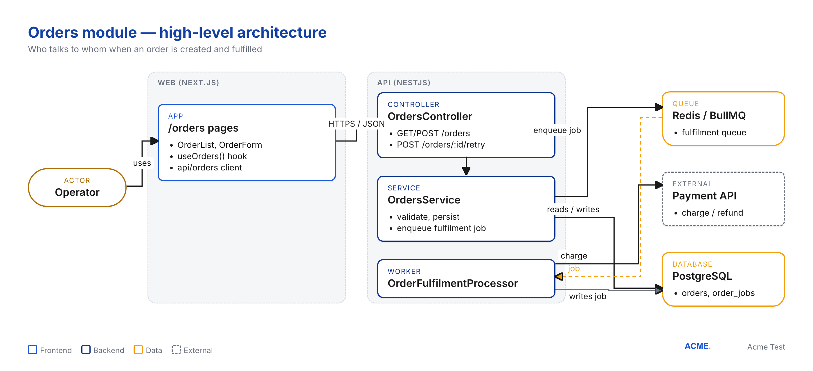
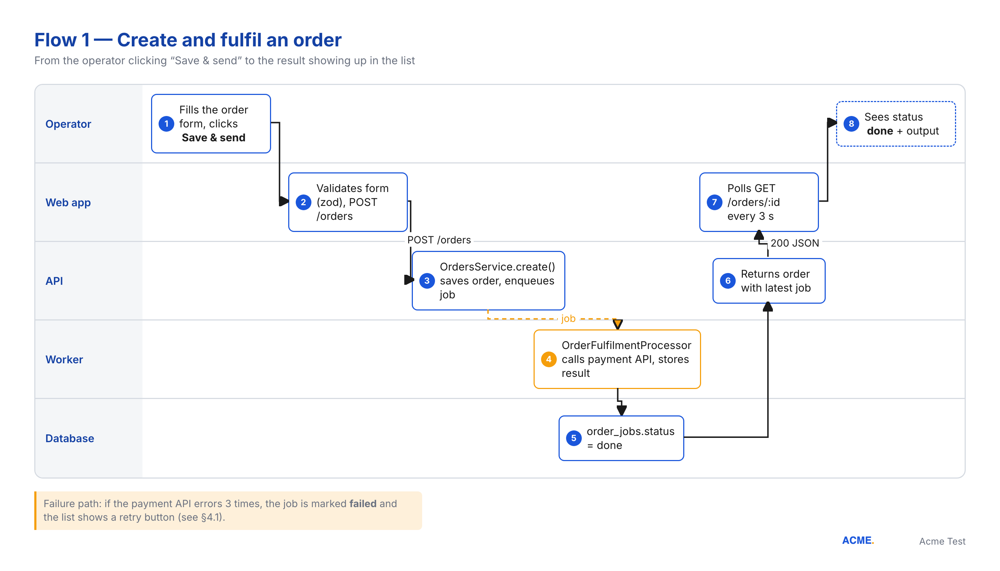

<!-- codebase-docs {"module": "orders", "title": "Orders module", "subtitle": "How operators create, fulfil and monitor orders across the web app and the API", "company": "Acme Test", "audience": "Developers + product (handover)", "language": "en", "generated": "2026-09-14", "engine": "html", "repos": {"web": {"sha": "a1b2c3d4e5f6a7b8c9d0", "branch": "main", "paths": ["src/app/orders/**", "src/hooks/useOrders.ts", "src/lib/api/orders.ts", "src/components/orders/**"]}, "api": {"sha": "0f1e2d3c4b5a69788796", "branch": "main", "paths": ["src/orders/**"]}}, "funding": {"program": "pnrr", "placement": "footer", "banners": ["funding/eu.png", "funding/guvern.png", "funding/pnrr.png"], "text": "Finanțat de Uniunea Europeană – NextGenerationEU", "identifiers": {"projectTitle": "Acme Orders Platform", "contractNumber": "760123/23.05.2024", "beneficiary": "Acme Test SRL"}}, "dirty": []} -->

# Orders module

## 1. Summary

The Orders module lets an operator create an order, send it to fulfilment, and follow it to completion. It exists because the previous spreadsheet process had no UI and no history. The mechanism in one sentence: the web app saves an order through the API, the API queues a fulfilment job, a worker charges the payment provider and stores the result, and the web app polls until the job is done.

## 2. How it works

An order is a row in `orders`. Each fulfilment attempt is a row in `order_jobs`. The API never calls the payment provider in the request path: it only enqueues a BullMQ job so the HTTP response stays fast and retries are handled by the queue, not by the browser.

Design choice: polling instead of websockets. Jobs take 5 to 40 seconds, and the team already had a polling hook. A websocket channel was judged not worth the operational cost. Source: comment in `api/src/orders/orders.service.ts:41`.

## 3. Architecture

| Component | Repo | Path | Responsibility |
|---|---|---|---|
| Orders pages | web | `src/app/orders/` | List, create and inspect orders |
| `useOrders()` | web | `src/hooks/useOrders.ts` | Data fetching and polling |
| `OrdersController` | api | `src/orders/orders.controller.ts` | HTTP surface, validation, auth guard |
| `OrdersService` | api | `src/orders/orders.service.ts` | Persistence and job enqueueing |
| `OrderFulfilmentProcessor` | api | `src/orders/order-fulfilment.processor.ts` | Executes fulfilment jobs against the payment API |

## 4. User flows

### 4.1 Create and fulfil an order

1. The operator fills the order form and clicks **Save & send**.
2. The web app validates the form with zod and sends `POST /orders`.
3. `OrdersService.create()` saves the order and enqueues a fulfilment job.
4. `OrderFulfilmentProcessor` calls the payment API and stores the result.
5. `order_jobs.status` becomes `done`.
6. The API returns the order with its latest job.
7. The web app polls `GET /orders/:id` every 3 seconds.
8. The operator sees the status and the output.

Failure path: after three payment API errors the job is marked `failed` and the list shows a retry button.

## 5. Data model

| Entity | Key fields | Relations | Store |
|---|---|---|---|
| `Order` | `id`, `customerId`, `total`, `note`, `ownerId`, `createdAt` | has many `OrderJob`; belongs to `User` | PostgreSQL `orders` |
| `OrderJob` | `id`, `orderId`, `status` (`queued`, `running`, `done`, `failed`), `output`, `error`, `startedAt`, `finishedAt` | belongs to `Order` | PostgreSQL `order_jobs` |

`status` moves `queued` → `running` → `done` or `failed`; a failed job keeps its `error` and can be retried from the list.

## 6. API surface

| Method | Path | Auth | Purpose | Frontend caller |
|---|---|---|---|---|
| GET | `/orders` | JWT, role `operator` | List orders with latest job | `useOrders()` |
| POST | `/orders` | JWT, role `operator` | Create an order and enqueue a fulfilment job | `OrderForm` |
| GET | `/orders/:id` | JWT, role `operator` | One order with its latest job (polled) | `useOrders()` |
| POST | `/orders/:id/retry` | JWT, role `operator` | Retry fulfilment of an existing order | `OrderList` |

## 7. Configuration

| Variable | Repo | Purpose |
|---|---|---|
| `PAYMENT_API_KEY` | api | Credential for the payment provider |
| `REDIS_URL` | api | BullMQ connection |
| `NEXT_PUBLIC_API_URL` | web | Base URL of the API |

## 8. Dependencies

| Package | Used by | Declared | Installed | Latest | Installed age | Status | Advisory |
|---|---|---|---|---|---|---|---|
| `@nestjs/bullmq` | 2 files | ^10.1.0 | 10.1.1 | 11.0.2 | 1.4 y | 1 major behind | — |
| `bullmq` | 2 files | ^5.7.0 | 5.7.8 | 5.34.0 | 1.6 y | minor/patch behind | — |
| `stripe` | 1 file | ^14.5.0 | 14.5.0 | 15.3.0 | 1.8 y | 1 major behind | — |
| `class-validator` | 3 files | ^0.14.0 | 0.14.0 | 0.14.1 | 2.5 y | minor/patch behind | — |
| `@tanstack/react-query` | 2 files | ^5.28.0 | 5.28.4 | 5.62.0 | 1.5 y | minor/patch behind | — |
| `zod` | 2 files | ^3.22.4 | 3.22.4 | 3.24.1 | 1.9 y | minor/patch behind | — |

Watch list:

- `stripe` 14.x is one major behind. 15.x changed the webhook signing helpers; only `order-fulfilment.processor.ts` calls it, so the upgrade is contained.
- `@nestjs/bullmq` 10.x pairs with NestJS 10; moving to 11 goes together with the framework upgrade.
- `class-validator` 0.14.0 is 2.5 years old with no vulnerability reported; the DTOs in `src/orders/dto/` are the only users.

## 9. Security — what to watch for

- `POST /orders/:id/retry` has the JWT guard but no ownership check: any operator can retry any order (`orders.controller.ts:48`). Add a tenant/owner guard before opening the module to more roles.
- The order note is stored as-is and sent to the payment provider as metadata without length limits (`orders.service.ts:33`). A 200 kB note is accepted; cap it in `CreateOrderDto`.
- The job result is rendered with `dangerouslySetInnerHTML` in `OrderJobResult.tsx:21`; it contains provider messages, treat them as untrusted and render as plain text or sanitise.
- `PAYMENT_API_KEY` is read once at boot; rotation needs a restart. Logs at `order-fulfilment.processor.ts:58` print the full card metadata at `debug` level — keep `debug` off in production.

## 10. Operations — what to monitor

| Signal | Where | Normal | When it is off |
|---|---|---|---|
| `fulfilment` queue depth | Redis / Bull board | < 20 | Worker down or payment API slow; check worker logs |
| Failed jobs in `fulfilment` | Bull board, `order_jobs.status = failed` | 0–2 per day | Inspect `order_jobs.error`; retries are exhausted after 3 |
| Payment API latency | `order-fulfilment.processor.ts` log line `run done in Nms` | 5–40 s | > 60 s means rate limiting; check the 429 counter |
| `POST /orders` 4xx rate | API access log | < 5 % | Validation errors from a new frontend build |

## 11. Glossary

- **Job**: one fulfilment attempt for an order, stored in `order_jobs`.
- **Operator**: a signed-in user with the `operator` role.
